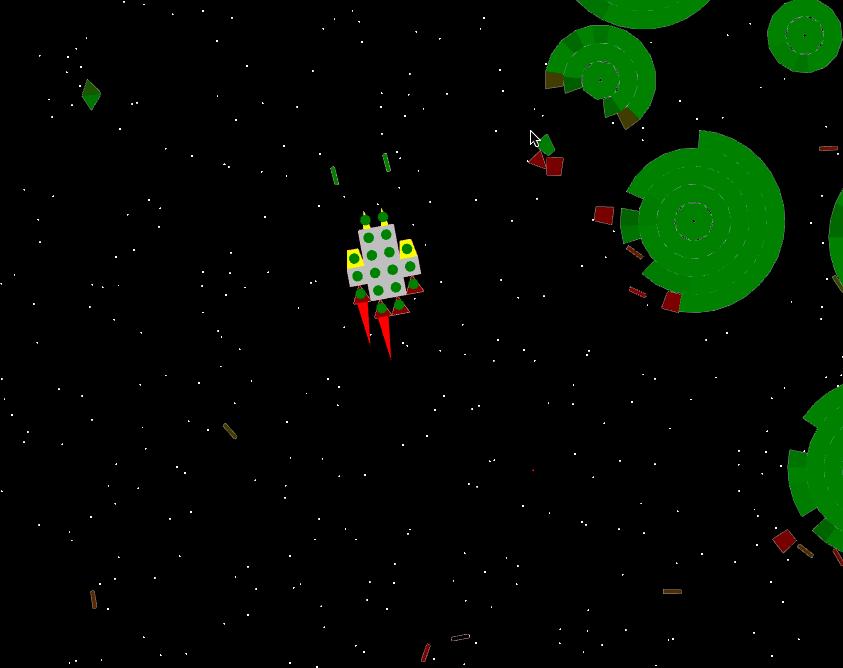

Spacecraft Game
---

A basic 2d space shooter sandbox, cobbled together in a couple of days.

### Features:

* Everything is destructible
* Physics
* Tile-based ship constructor
* Lasers and railguns
* Infinite pseudo-random stars with parallax!

### Usage

* Download [the latest release](https://github.com/Aivean/spacecraft-game/releases/latest)
* Run `java -jar release-name.jar`
    
   Should work on Windows, Linux and Mac. 

### Building from source

* Note: project is old, it requires JDK 8 (not newer!) to build
* Run `./mvnw clean package`
* Look for `spacecraft-game/desktop/target/desktop-1.0-SNAPSHOT-jar-with-dependencies.jar`

### Tech stack
 
* Scala 2.11
* Libgdx 1.6.4: (box2d, ui)

### License

Libgdx is licensed under the [Apache 2.0 license](https://github.com/libgdx/libgdx/blob/master/LICENSE).
